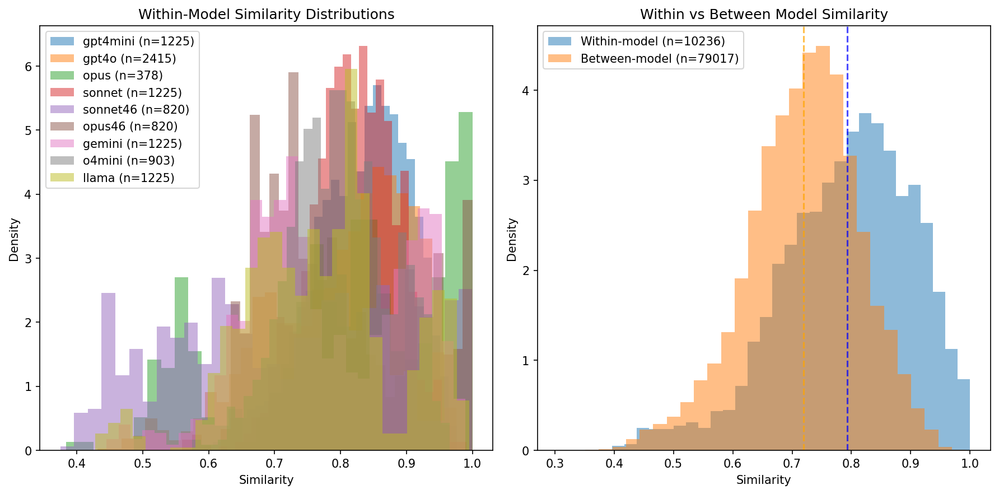
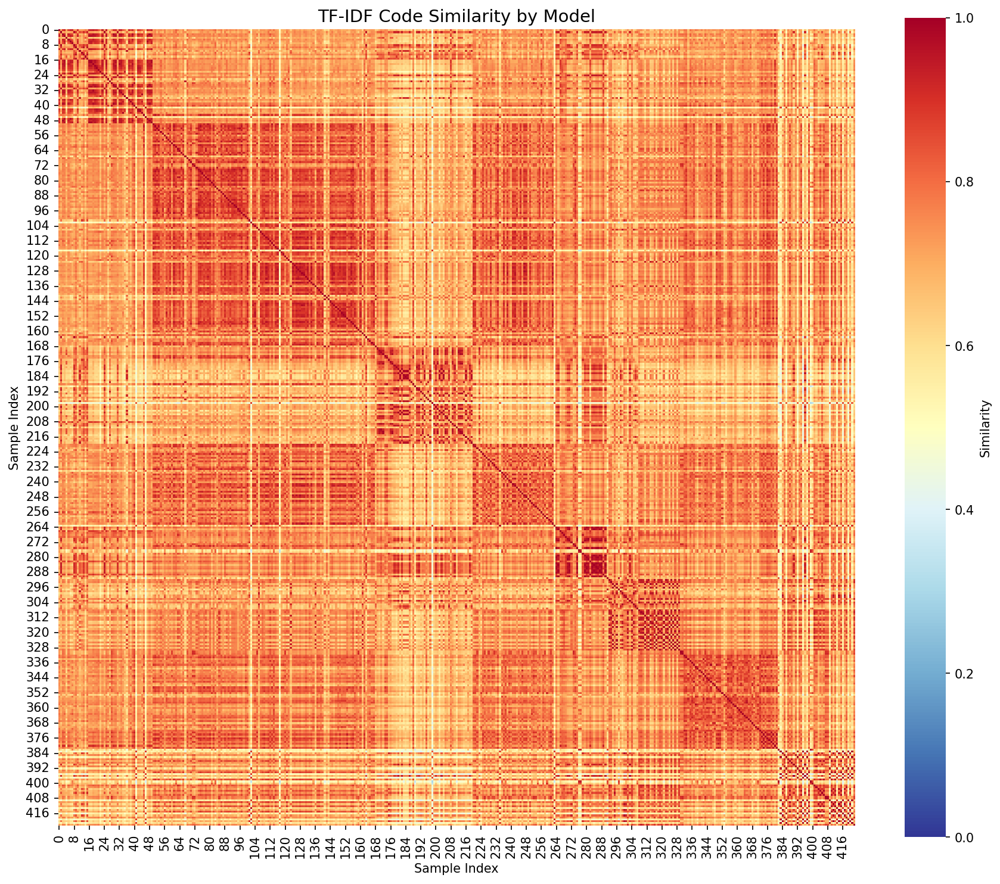
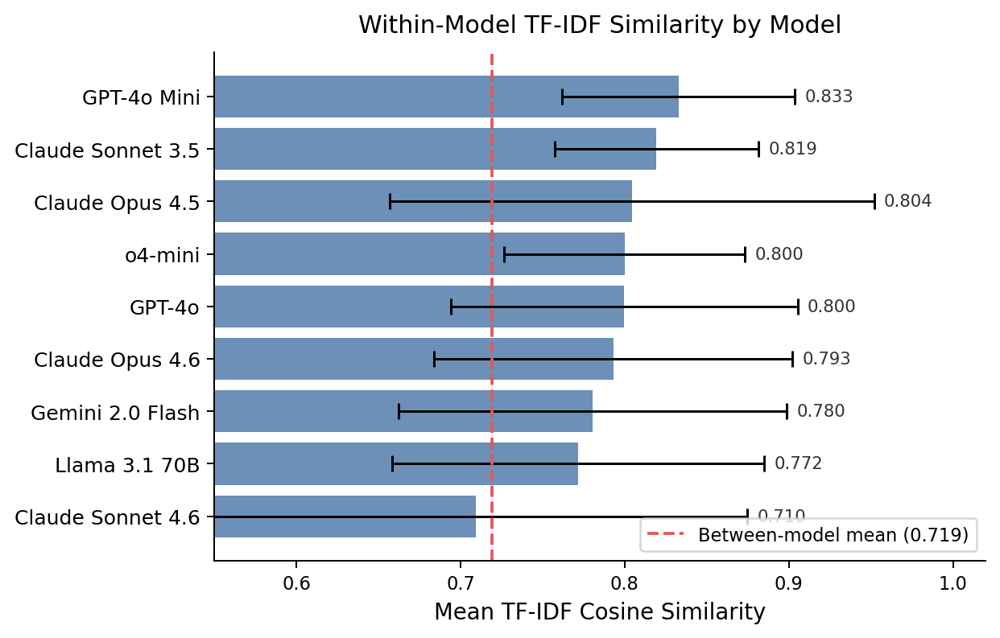

# Detecting AI-Generated Code in Introductory CS Submissions: A Multi-Model Fingerprinting Approach

**Uditi Sharma**
Computer Science, NYUAD
us2133@nyu.edu

Advised by: [Professor Name], [Secondary Grader]

**Reference Format:**
Uditi Sharma. 2026. Detecting AI-Generated Code in Introductory CS Submissions: A Multi-Model Fingerprinting Approach. In *NYUAD Capstone Seminar Reports, Spring 2026, Abu Dhabi, UAE.* 6 pages.

---

## Abstract

The availability of large language models has created a real gap in academic integrity enforcement for programming courses. MOSS, the standard plagiarism detection tool, works by finding shared substrings between student submissions. It is completely ineffective against AI-generated code because each generation is unique and shares no source document with any other. AI tool adoption among CS students has grown rapidly since 2022, with widespread documented use across computing programs worldwide [2], yet detection infrastructure has not kept pace.

This project investigates two questions. First, do different AI models leave statistically distinguishable stylistic fingerprints in CS1 assignment code, and do those fingerprints survive prompt-level style variation? Second, can a supervised classifier reliably separate AI-generated submissions from pre-ChatGPT student code on the same assignment? Preliminary results on 423 Connect4 Python implementations generated by 9 models show strong fingerprint persistence (Cohen's d = 0.720, p < 0.001), with 33 of 36 model pairs statistically distinguishable by TF-IDF similarity alone. The second question requires a human baseline of pre-2022 student submissions, which we are obtaining from the course instructor.

**Keywords:** AI-generated code detection, academic integrity, code stylometry, authorship attribution, large language models, CS education

---

## 1 Introduction

When a student submits Python code for a Connect4 assignment, there is currently no reliable way to determine whether they wrote it or generated it with GPT-4o, Claude, or Gemini. MOSS, the standard plagiarism detection tool used in CS departments, works by fingerprinting document content and comparing shared substrings between submissions [1]. It catches copy-paste between students effectively, but AI-generated code has no source document to share with any other submission. Every generation is unique, and MOSS reports a similarity near zero.

The scale of the problem is real. AI tool adoption among CS students has grown rapidly since 2022, with widespread documented use across institutions and countries [2], and self-reporting surveys likely undercount actual usage. Instructors who reuse the same assignments year after year are especially exposed, since standard problems (Connect4, Tic-Tac-Toe, Hangman) are exactly the kind that LLMs handle well.

Prior work on detection has made progress but remains narrow. Hoq and Leinonen [3] showed that machine learning classifiers can distinguish ChatGPT-generated Java code from human-written code with up to 97% accuracy on simple CS1 problems. Xu and Sheng [4] applied perplexity-based methods to code assignments and achieved an average AUC of 0.87. But both studies tested a single model against short programs (around 10 lines). In practice, students use GPT-4o, Claude, Gemini, and other tools, and the programs they submit are far more substantial. It remains an open question whether AI fingerprints hold across models, and whether different models leave distinguishable signatures.

This project addresses two research questions:

**RQ1 (Multi-model fingerprinting):** Do different AI models leave statistically distinguishable stylistic fingerprints in CS1 assignment code, and do those fingerprints persist across 15 prompt-level style variations?

**RQ2 (AI vs. human detection):** Can a supervised classifier reliably separate AI-generated submissions from pre-ChatGPT student code on the same assignment?

RQ1 is answered with data already collected and analyzed. RQ2 will be completed in the following semesters as the pre-2022 student submissions are integrated and the classifier is trained.

---

## 2 Related Work

**Detecting ChatGPT in CS1 (Hoq and Leinonen, SIGCSE 2024) [3].** The closest prior work in the educational setting. They trained classifiers on ChatGPT-generated and human-written Java solutions to simple CS1 problems. Their best model achieved 97% accuracy. However, they tested only GPT-3.5, used short programs (roughly 10 lines), and produced binary labels. Binary labels are problematic for academic integrity cases where a probability score with interpretable evidence is far more defensible.

**AIGCode (Xu and Sheng, AAAI 2024) [4].** This paper framed the problem identically to ours: detecting AI-generated code in academic submissions. Their method uses targeted masking and CodeBERT fill-in to compute perplexity scores, achieving AUC 0.87 against text-davinci-003. They used competitive programming problems from CodeNet rather than actual student submissions, and tested only one model.

**DetectCodeGPT (Shi et al., ICSE 2025) [5].** The most rigorous zero-shot approach published so far. Their NPR metric (Normalized Perturbed Log Rank) exploits the fact that machine-generated code is more locally optimal under the model that produced it. They achieved AUROC 0.93 in some settings. However, they only tested small open-source models under 7 billion parameters such as Incoder, StarCoder, and CodeLlama, and explicitly did not test GPT-4o or Claude, which are the models students actually use.

**GPTSniffer (Nguyen et al., JSS 2024) [6].** Fine-tuned CodeBERT as a binary classifier, achieving near-perfect precision when training used paired samples (human and AI solving the same problem), compared to F1 around 0.73 with unpaired data. This validates our paired training design for RQ2. They tested only GPT-3.5 on GitHub code snippets, not assignment submissions.

**AIGC detectors fail on code (Wang et al., 2023) [7].** Systematically evaluated six existing AIGC detectors on code. All performed significantly worse on code than on natural language text, and cross-domain generalization stayed poor even after fine-tuning. This motivates assignment-specific detectors over general-purpose tools.

**Embedding and classifier approaches (Oedingen et al., AI 2024) [8].** Benchmarked multiple detection methods including Random Forest, XGBoost, and DNN on embedding features. Embedding plus DNN achieved 98% accuracy; humans alone cannot detect AI code at above-chance rates. Their results support our classifier choice for RQ2.

**CodeBERT (Feng et al., EMNLP 2020) [9].** A RoBERTa-based model pre-trained on natural language and code pairs. We use CodeBERT's [CLS] token embeddings as semantic features. It was designed for NL-to-code retrieval, not authorship analysis. Our use is an empirical extension, and we report it as such.

---

## 3 Methodology

### 3.1 Dataset Construction

We built a controlled dataset of 370 Connect4 Python implementations generated by 9 LLMs across two generations. Connect4 is a standard CS1 assignment requiring a 6x7 board, two-player logic with checkers X and O, win detection in four directions, input validation, and screen-clearing between turns. Using a specific assignment with concrete requirements allows direct comparison across models and, eventually, with human submissions.

**Table 1: Dataset**

| Model | Year | N |
|---|---|---|
| GPT-4o | 2024 | 70 |
| GPT-4o Mini | 2024 | 50 |
| Claude Sonnet 3.5 | 2024 | 50 |
| Gemini 2.0 Flash | 2024 | 50 |
| Llama 3.1 70B | 2024 | 50 |
| Claude Opus 4.5 | 2025 | 28 |
| o4-mini | 2025 | 43 |
| Claude Sonnet 4.6 | 2025 | 41 |
| Claude Opus 4.6 | 2025 | 41 |
| **Total** | | **423** |

Each model was prompted under 15 distinct style instructions: beginner-friendly, compact, PEP 8-compliant, modular, extensively documented, functional, minimal whitespace, and so on. This tests whether fingerprints survive the surface-level variation that a student might apply when trying to make AI-generated code look more personal. The average file is 110 lines long.

Two additional models (Gemini 2.5 Flash and Pro) were excluded after we found they consistently generated truncated 20-line files. Their internal reasoning tokens consumed the 3,000-token generation budget before any actual code was output. This is a reproducible limitation of applying thinking models to code generation with a fixed token budget, and we include it as a methodological note.

Data was generated in two phases. The 2024 models were generated via OpenRouter. The 2025 models were generated via NYU's Portkey AI Gateway. Each file has a provenance header recording model, timestamp, style index, token counts, and MD5 hash.

### 3.2 Feature Extraction

We extract three complementary representations from each file.

**Lexical features (TF-IDF).** We tokenize each file using Python's built-in tokenizer to produce unigrams and bigrams of token types, keywords, and identifiers. TF-IDF vectors capture vocabulary habits: which variable names a model prefers, how it structures loops, whether it uses list comprehensions. This is fast to compute and provides strong preliminary signal.

**Structural features (AST-based).** We parse each file into an Abstract Syntax Tree and extract: function count, cyclomatic complexity, maximum nesting depth, comment density, average function length, and use of list comprehensions and lambda expressions. These capture code organization at a structural level independent of vocabulary.

**Semantic features (CodeBERT).** We pass each file through CodeBERT and extract the [CLS] token embedding as a 768-dimensional vector. This is an empirical probe: we test whether semantic similarity in CodeBERT's embedding space correlates with model identity. We do not claim this is what CodeBERT was designed to do.

**Pipeline overview:**

```
423 Python files (9 models, 15 styles)
              |
         Preprocess
    (strip header, validate)
      /         |         \
  TF-IDF      AST       CodeBERT
  lexical  structural   semantic
      \         |         /
    Pairwise cosine similarity matrices
              |
      Mann-Whitney U + Cohen's d
              |
         RQ1 results  (complete)
              |
       RQ2 classifier  (planned)
```

### 3.3 Similarity Analysis (RQ1)

For each feature type, we compute an N x N pairwise cosine similarity matrix. We then separate pairwise scores into two groups: within-model pairs (same model generated both files) and between-model pairs (different models). We compare distributions using the Mann-Whitney U test (a non-parametric test that makes no assumption of normality) and measure effect size with Cohen's d. We also compare per-model within-group distributions pairwise to determine which model pairs are statistically distinguishable.

### 3.4 Classification (RQ2, planned Fall 2026)

The pre-ChatGPT student submissions are in hand from the course instructor. Next semester, we will train Random Forest and XGBoost classifiers using all three feature types, with stratified cross-validation. The output will be a probability score rather than a binary label. Binary "AI or not" labels are inappropriate for academic integrity cases, where false accusations carry serious consequences for students. We will prioritize precision over recall for the same reason.

---

## 4 Evaluation

### 4.0 Hypotheses

**H1 (RQ1 — overall fingerprint):** Within-model TF-IDF cosine similarity is significantly higher than between-model similarity, indicating that AI models produce code with consistent stylistic patterns.
*Status: Confirmed. Cohen's d = 0.720, p < 0.001.*

**H2 (RQ1 — pairwise distinguishability):** Most pairwise model combinations are statistically distinguishable by their stylistic fingerprints across 15 prompt-level style variations.
*Status: Confirmed. 27 of 36 pairs significant at p < 0.001; 33 of 36 significant at p < 0.05.*

**H3 (RQ2 — AI vs. human, planned):** A classifier trained on TF-IDF, AST, and CodeBERT features can distinguish AI-generated Connect4 code from pre-ChatGPT student submissions with AUC >= 0.90.
*Status: To be evaluated Fall 2026.*

### 4.1 Preliminary Results (RQ1)

**Overall fingerprint signal.** Across all 423 files, within-model TF-IDF cosine similarity (mean 0.793) significantly exceeds between-model similarity (mean 0.719). The mean difference is 0.074, Cohen's d = 0.720, and p < 0.001 (Mann-Whitney U test, effectively zero). This is a medium-to-large effect: the within-model and between-model distributions are meaningfully separated, not just statistically distinguishable.





**Per-model consistency (Table 2).** Within-model similarity varies across models.

| Model | Era | N | Mean | Std |
|---|---|---|---|---|
| GPT-4o Mini | 2024 | 50 | 0.833 | 0.071 |
| Claude Sonnet 3.5 | 2024 | 50 | 0.819 | 0.062 |
| Claude Opus 4.5 | 2025 | 28 | 0.804 | 0.148 |
| o4-mini | 2025 | 43 | 0.800 | 0.073 |
| GPT-4o | 2024 | 70 | 0.800 | 0.106 |
| Claude Opus 4.6 | 2025 | 41 | 0.793 | 0.109 |
| Gemini 2.0 Flash | 2024 | 50 | 0.780 | 0.118 |
| Llama 3.1 70B | 2024 | 50 | 0.772 | 0.113 |
| Claude Sonnet 4.6 | 2025 | 41 | 0.710 | 0.165 |

GPT-4o Mini has the highest internal consistency (0.833). Claude Sonnet 4.6 shows the most variation (mean 0.710, std 0.165). Claude Opus 4.5 (28 files) has wide spread (std 0.148), consistent with its smaller sample. The 15-style variation design was meant to stress-test the fingerprints, and most models maintain consistent similarity across those styles.

**Distinguishable pairs.** Of 36 pairwise model comparisons, 27 are highly significant (p < 0.001), 6 are significant at p < 0.05, and 3 are not distinguishable by TF-IDF alone:

- GPT-4o Mini vs. Claude Opus 4.5 (p = 0.210)
- Claude Opus 4.5 vs. Claude Sonnet 3.5 (p = 0.467)
- Gemini 2.0 Flash vs. Llama 3.1 70B (p = 0.314)

The two non-significant Anthropic pairs (Opus 4.5 and Sonnet 3.5) support the hypothesis that same-company models share architectural patterns producing lexically similar code. The Gemini--Llama overlap is harder to explain by lineage and may reflect coincidental lexical similarity at the assignment level. These three pairs motivate the multi-feature classifier planned for Fall 2026.



---

## 5 Project Timeline

This proposal covers work completed in Spring 2026. The capstone will be completed in Fall 2026.

**Spring 2026 (this semester) — complete:**

| Task | Status |
|---|---|
| AI dataset construction (423 files, 9 models) | Complete |
| Feature extraction: TF-IDF, AST, CodeBERT | Complete |
| Similarity analysis and hypothesis testing (RQ1) | Complete |
| Capstone proposal | Complete |

**Fall 2026:**
- Integrate pre-2022 student Connect4 submissions (in hand from course instructor) as the human baseline
- Train and evaluate Random Forest and XGBoost classifier for RQ2
- Incorporate CodeBERT embeddings into the full classifier pipeline
- Finalize RQ2 evaluation across all feature types and style variations
- Write, submit, and defend the full capstone paper (target: SIGCSE 2026 or EDM 2026)


---

## 6 Budget

**Data collection (complete, $0):** All 423 AI-generated files were produced through NYU's Portkey AI Gateway and OpenRouter, billed to the university at no cost to this project. No further API budget is needed — the dataset is fixed.

**Compute (current, $0):** Feature extraction, TF-IDF vectorization, AST parsing, and CodeBERT inference all run on personal hardware. The full 423-file dataset processes in under one hour on a standard laptop. No cloud compute is required.

**Compute (planned, $0):** Random Forest and XGBoost training on a few hundred samples requires negligible compute. If larger-scale experiments become necessary, NYU HPC provides GPU nodes at no cost to registered students.

**Total budget requested: $0.**

---

## 7 Conclusion

This project makes three contributions beyond prior work. It is the first multi-model fingerprinting study on CS1 assignment code, covering 9 models across two LLM generations (2024 and 2025). All prior work tested a single model. It uses a verified pre-ChatGPT student baseline rather than GitHub code as a proxy for human writing, which better matches the actual detection target in educational settings. And it operates on realistic-length CS1 implementations (average 110 lines) rather than the short snippets (roughly 10 lines) used in prior work, providing evidence that fingerprints persist at assignment-relevant complexity.

Preliminary results on RQ1 show strong and statistically significant fingerprints across most model pairs. The full AI vs. human classification task (RQ2), using the pre-2022 student submissions now in hand, will be completed in Fall 2026. It will complete the pipeline from "can we tell models apart?" to "can we tell AI from a real student?"

---

## References

[1] S. Schleimer, D.S. Wilkerson, and A. Aiken. "Winnowing: Local Algorithms for Document Fingerprinting." *Proc. ACM SIGMOD*, pp. 76-85, 2003.

[2] J. Prather, P. Denny, J. Leinonen, B.A. Becker, I. Albluwi, M. Craig, H. Keuning, N. Kiesler, T. Kohn, A. Luxton-Reilly, S. MacNeil, A. Petersen, R. Pettit, B.N. Reeves, and J. Savelka. "The Robots Are Here: Navigating the Generative AI Revolution in Computing Education." *Proc. ACM ITiCSE-WGR*, 2023. https://doi.org/10.1145/3623762.3633499

[3] M. Hoq, Y. Shi, J. Leinonen, D. Babalola, C. Lynch, and B. Akram. "Detecting ChatGPT-Generated Code Submissions in a CS1 Course." *Proc. ACM SIGCSE*, 2024. https://dl.acm.org/doi/10.1145/3626252.3630826

[4] Z. Xu and V.S. Sheng. "Detecting AI-Generated Code Assignments Using Perplexity of Large Language Models." *Proc. AAAI*, vol. 38, no. 21, pp. 23155-23162, 2024. https://doi.org/10.1609/aaai.v38i21.30361

[5] Y. Shi, H. Zhang, C. Wan, and X. Gu. "Between Lines of Code: Unraveling the Distinct Patterns of Machine and Human Programmers." *Proc. ICSE 2025*. arXiv:2401.06461

[6] P.T. Nguyen, J. Di Rocco, C. Di Sipio, R. Rubei, D. Di Ruscio, and M. Di Penta. "Is this Snippet Written by ChatGPT? An Empirical Study with a CodeBERT-Based Classifier." *Journal of Systems and Software*, vol. 214, 2024. https://doi.org/10.1016/j.jss.2024.112059

[7] J. Wang, S. Liu, X. Xie, and Y. Li. "Evaluating AIGC Detectors on Code Content." arXiv:2304.05193, 2023.

[8] M. Oedingen, R.C. Engelhardt, R. Denz, M. Hammer, and W. Konen. "ChatGPT Code Detection: Techniques for Uncovering the Source of Code." *AI (MDPI)*, vol. 5, no. 3, pp. 1066-1094, 2024.

[9] Z. Feng, D. Guo, D. Tang, et al. "CodeBERT: A Pre-Trained Model for Programming and Natural Languages." *Findings of ACL: EMNLP 2020*, pp. 1536-1547. https://doi.org/10.18653/v1/2020.findings-emnlp.139
